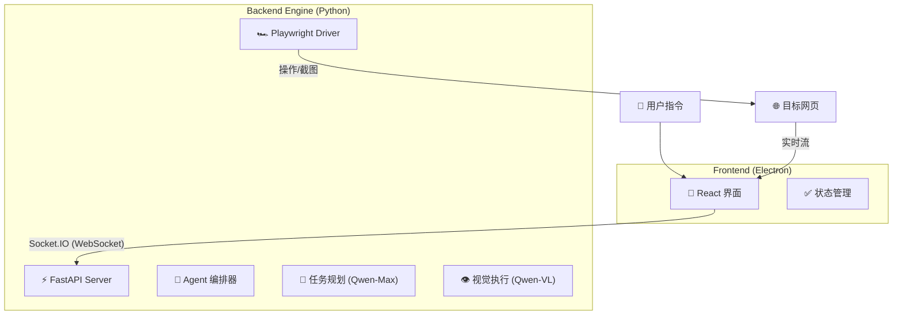

<div align="center">

# DianDian (点点) 🖱️

### **"像聊天一样完成软件测试"**
**Chat to Test - 您的 AI 结对测试搭档**

[](https://www.python.org/)
[](https://reactjs.org/)
[](https://www.electronjs.org/)
[](https://playwright.dev/)
[](LICENSE)

</div>

---

**DianDian (点点)** 是一款专为手工测试人员 (Manual QA) 设计的桌面端 AI 辅助工具。它将复杂的自动化代码封装在自然语言交互之后，让您只需通过对话即可驱动本地浏览器执行测试任务，并自动生成可视化的测试报告。

## ✨ 核心亮点 (Core Features)

| 特性 | 说明 |
| :--- | :--- |
| **🗣️ 自然语言驱动** | 告别 Python/Selenium 代码，直接说 *"帮我测试登录流程"*。 |
| **🧠 自愈型 AI** | 基于视觉识别 (Vision) 的元素定位，UI 变了也不怕，告别 `SelectorNotFoundError`。 |
| **👀 实时可视化** | 独创 **SoM (Set-of-Mark)** 技术，实时展示 AI 的注视点与操作意图。 |
| **🛠️ 强大的动作库** | 支持点击、输入、滚动、悬停、后退，覆盖 90% 的 Web 操作场景。 |
| **🔌 开箱即用** | 本地 Electron 应用，内置 Python 引擎，零配置一键启动。 |

## 🏗️ 技术架构 (Architecture)

DianDian 采用 **GUI + Engine 双进程分离架构**，确保极致的响应速度与稳定性。



## 🚀 快速开始 (Quick Start)

### 环境要求
*   **Node.js**: v18+
*   **Python**: 3.11+
*   **API Key**: 阿里云 DashScope (通义千问)

### 安装与运行 (开发模式)

1.  **克隆项目**
    ```bash
    git clone https://github.com/wssab314/DianDian.git
    cd DianDian
    ```

2.  **启动 Python 引擎**
    ```bash
    cd engine
    pip install -r requirements.txt
    python server.py
    ```

3.  **启动 Electron 界面** (新开终端)
    ```bash
    npm install
    npm run dev
    ```

## 🗺️ 路线图 (Roadmap)

我们正在快速迭代中！以下是功能发布计划：

### ✅ v0.1: MVP 原型 (已发布)
- [x] **基础对话**: 支持自然语言下达测试指令。
- [x] **视觉感知**: 集成 Qwen-VL 多模态模型与 SoM 标记技术。
- [x] **浏览器控制**: 基于 Playwright 实现导航、点击、输入。
- [x] **任务管理**: 支持任务中断 (Stop) 与状态反馈。

### 🚀 v0.2: 动作增强 (Current)
- [x] **更多动作**: 新增 Scroll (滚动), Back (后退), Hover (悬停)。
- [x] **稳定性**: 修复输入兼容性问题，优化反爬虫对抗 (User-Agent)。
- [ ] **错误重试**: 智能识别失败并自动重试。

### 🔮 v1.0: 生产就绪 (Coming Soon)
- [ ] **本地报告**: 自动生成 HTML 测试报告（含视频回放）。
- [ ] **用例库**: 支持用例的保存、管理与批量回放。
- [ ] **断言支持**: "检查页面标题是否包含..."

## 🤝 贡献 (Contribution)

欢迎提交 Issue 反馈 Bug 或 提交 Pull Request！

## 📄 许可证 (License)

本项目采用 [MIT License](LICENSE) 开源。
