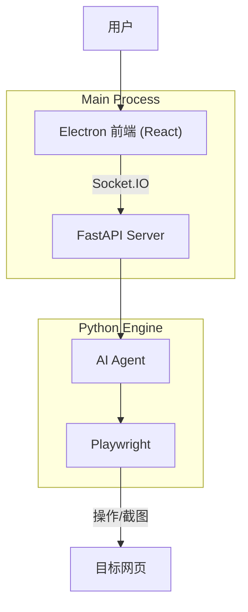

# DianDian (点点) 🖱️

> **"像聊天一样完成软件测试。"**  
> Chat to Test - 您的 AI 结对测试搭档。

DianDian (点点) 是一款专为手工测试人员 (Manual QA) 设计的桌面端 AI 辅助工具。它将复杂的自动化代码封装在自然语言交互之后，让您只需通过对话即可驱动本地浏览器执行测试任务，并自动生成可视化的测试报告。

---

## ✨ 核心亮点

*   **🗣️ 自然语言驱动**: 告别 Python/Selenium 代码，直接告诉 AI "帮我测试登录流程"。
*   **🔌 开箱即用**: 本地桌面应用 (Electron)，内置微型 Python 环境，无需繁琐配置。
*   **🧠 由于 AI 自愈**: 页面 UI 变了？不用怕。AI 基于视觉识别元素，不再因为 Class名变更而报错。
*   **🎥 可视化报告**: 自动生成包含视频回放、步骤截图、网络日志的 HTML 报告。
*   **👀 实时可视化**: 独特的“视觉标记 (Set-of-Mark)”技术，让您实时看到 AI 的“视线”和操作焦点。

## 🏗️ 技术架构

DianDian 采用 **双进程分离架构**，确保界面流畅与逻辑强大的完美结合：

*   **🎨 前端 (GUI)**:
    *   **Electron 28+**: 跨平台桌面容器。
    *   **React 18 + Shadcn/UI**: 现代、美观的用户交互界面。
    *   **Socket.IO Client**: 负责与 Python 引擎的实时通信。

*   **🧠 后端 (Engine)**:
    *   **Python 3.11**: 独立打包的运行时环境。
    *   **LangGraph Agent**: 具备状态记忆和逻辑推理的 AI 核心。
    *   **Playwright**: 行业标准的浏览器自动化控制。
    *   **FastAPI + Socket.IO Server**: 高性能的本地指令服务器。



## 🚀 快速开始 (开发模式)

### 前置要求
*   Node.js (v18+)
*   Python (3.11+)
*   pnpm 或 npm

### 1. 克隆项目
```bash
git clone https://github.com/your-username/DianDian.git
cd DianDian
```

### 2. 初始化项目
(详细脚本正在建设中...)

### 3. 启动开发环境
```bash
# 终端 1: 启动 Python 引擎
cd engine
pip install -r requirements.txt
python server.py

# 终端 2: 启动 Electron 界面
npm install
npm run dev
```

## 🗺️ 路线图 (Roadmap)

- [ ] **v0.1 (MVP)**: 
    - [ ] 基础对话界面与浏览器控制。
    - [ ] 支持用户自定义 OpenAI API Key。
    - [ ] 简单的单流程测试回放。
- [ ] **v1.0**: 
    - [ ] 完整的本地报告生成。
    - [ ] AI 元素定位自愈功能。
- [ ] **v1.5 (Pro)**: 
    - [ ] 云端大模型直连通道。
    - [ ] 用例库管理与云同步。

## 🤝 贡献

欢迎提交 Issue 和 Pull Request！

## 📄 许可证

[MIT License](LICENSE)
