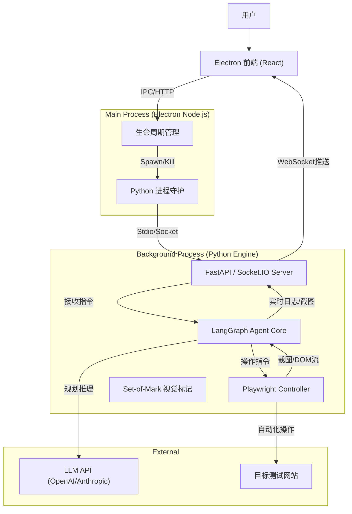

---

# DianDian (MVP) 技术架构设计文档

**项目名称：** DianDian (点点)
**文档版本：** v1.0
**架构核心：** Electron (GUI) + Python (Agent Engine) 双进程架构

---

## 1. 架构总览 (System Architecture)

DianDian 采用 **“UI 与 逻辑分离”** 的双进程架构。
*   **前端（Electron）：** 负责“皮囊”。提供聊天界面、设置面板、日志展示和结果回放。
*   **后端（Python）：** 负责“大脑”和“手脚”。运行 AI Agent、控制 Playwright 浏览器、处理图像识别。

### 1.1 逻辑架构图


---

## 2. 技术栈选型 (Tech Stack)

### 2.1 桌面端 (Host & UI)
*   **框架:** **Electron 28+** (保证安全性与最新 Chrome 内核)
*   **UI 库:** **React 18** + **Vite** (构建工具)
*   **组件库:** **Shadcn/UI** (基于 Radix UI，美观、现代，符合“点点”的轻量感) + TailwindCSS
*   **状态管理:** **Zustand** (轻量级，管理聊天记录和任务状态)

### 2.2 核心引擎 (Python Backend)
*   **运行时:** **Python 3.11** (嵌入式独立环境)
*   **Web 服务:** **FastAPI** + **Python-SocketIO** (实现双向实时通信)
*   **浏览器自动化:** **Playwright Python** (行业标准)
*   **AI 编排:** **LangGraph** (支持循环、状态记忆的 Agent 框架)
*   **打包工具:** **PyInstaller** (打成单文件或单目录)

### 2.3 数据存储
*   **配置存储:** `config.json` (API Key, 主题设置) - 存放在 `app.getPath('userData')`
*   **任务数据:** **SQLite** (存储历史任务、测试结果元数据)
*   **文件资产:** 本地文件系统 (截图、MP4 录屏、HTML 报告)

---

## 3. 核心模块详细设计

### 3.1 进程通信机制 (The Bridge)

这是最关键的部分。为了避免 Electron 和 Python 耦合过紧，我们采用 **Socket.IO (WebSocket)** 进行通信。

*   **启动流程:**
    1.  Electron 启动。
    2.  Electron 主进程查找内部打包的 Python 可执行文件路径。
    3.  Electron `spawn` Python 子进程。
    4.  Python 启动 FastAPI 服务在 `localhost:随机端口`。
    5.  Python 将端口号打印到 stdout。
    6.  Electron 读取 stdout 获取端口，通过 Socket.IO 客户端连接 Python 服务。

*   **通信协议定义:**

| 方向     | 事件名 (Event)     | 数据 (Payload)                              | 说明               |
| :------- | :----------------- | :------------------------------------------ | :----------------- |
| UI -> Py | `start_task`       | `{ goal: "买T恤", url: "..." }`             | 开始新测试         |
| UI -> Py | `user_input`       | `{ text: "在右上角", coords: [x,y] }`       | 人工干预/纠正      |
| UI -> Py | `stop_task`        | `{}`                                        | 强制停止           |
| Py -> UI | `agent_thought`    | `{ text: "正在分析..." }`                   | AI 思考过程        |
| Py -> UI | `browser_snapshot` | `{ base64: "...", som_overlay: [] }`        | 带标记的实时画面流 |
| Py -> UI | `task_status`      | `{ status: "success", report_path: "..." }` | 任务结束           |
| Py -> UI | `error`            | `{ msg: "网络超时" }`                       | 错误提示           |

### 3.2 视觉标记与操作 (SoM Implementation)

为了让“点点”看得准，必须实现 Set-of-Mark。

1.  **注入阶段:** Python 调用 Playwright 的 `page.evaluate()` 注入一段 JavaScript。
2.  **标记逻辑:** JS 遍历 DOM 中的交互元素 (Button, Input, A)，计算 BoundingBox，在页面顶层覆盖一个带有数字 ID 的 `div`。
3.  **截图传输:** 截图发送给 GPT-4o。
4.  **动作映射:** 模型返回 `{"action": "click", "id": 12}` -> Python 查找 ID 为 12 的元素坐标 -> Playwright 执行点击。

### 3.3 本地浏览器预览 (Live View)

MVP 版本为降低复杂度，采用 **流式截图** 方案：
*   Python 端每执行一个 Action 或每隔 500ms，对 Playwright 的 Page 进行截图（压缩质量）。
*   通过 Socket.IO 发送 Base64 图片给前端 React 组件展示。
*   **优势:** 容易实现，且可以直接在截图上绘制 AI 的关注点（边框、视线轨迹）。
*   *注：Playwright 的 Headful 窗口也可以同时弹出，用户可以选择看 Electron 里的截图流，或者直接看弹出的浏览器。*

---

## 4. 工程目录结构

```text
DianDian-Project/
├── electron/              # Electron 主进程代码
│   ├── main.ts            # 入口，窗口创建
│   ├── python-manager.ts  # Python 进程生成与管理
│   └── preload.ts         # 安全桥接
├── src/                   # React 前端代码
│   ├── components/        # ChatBox, LiveView, Settings
│   └── App.tsx
├── engine/                # Python 核心引擎
│   ├── agent/             # AI 逻辑
│   │   ├── core.py        # LangGraph 状态机
│   │   ├── planner.py     # 规划层
│   │   └── executor.py    # 执行层
│   ├── browser/           # Playwright 封装
│   │   ├── driver.py
│   │   └── som.js         # 视觉标记脚本
│   ├── server.py          # FastAPI + SocketIO 入口
│   └── requirements.txt
├── resources/             # 静态资源 (Logo, Icons)
├── scripts/               # 打包脚本
│   ├── build-python.sh    # PyInstaller 构建脚本
│   └── build-app.sh       # Electron Builder 脚本
└── package.json
```

---

## 5. 打包与分发策略 (Distribution)

这是本地工具最大的痛点：如何让用户不需要安装 Python 环境。

### 5.1 Python 环境打包
使用 **PyInstaller** 将 `engine/` 目录打包成一个独立的文件夹。
*   **命令示例:**
    ```bash
    pyinstaller --noconfirm --onedir --windowed --name "dian_engine" --add-data "engine/browser/som.js;." engine/server.py
    ```
*   **产物:** 生成 `dist/dian_engine/` 文件夹，内部包含 `dian_engine.exe` 及所有依赖库。

### 5.2 浏览器二进制管理
Playwright 需要浏览器内核（Chromium）。
*   **方案:** 既然是 MVP，为了减小包体积，**不将浏览器打包进安装包**。
*   **首次启动体验:**
    1.  用户安装并打开“点点”。
    2.  应用检测本地 Playwright 浏览器缓存。
    3.  若未检测到，Electron 界面显示：“正在初始化测试引擎（下载浏览器内核）... 0%”。
    4.  Python 后端调用 `playwright install chromium`。
    5.  下载完成后进入主界面。

### 5.3 最终安装包 (Electron Builder)
配置 `electron-builder`，将 PyInstaller 生成的 `dist/dian_engine` 文件夹作为 `extraResources` 复制到安装包内部。
*   **产物:** `DianDian-Setup-0.1.0.exe` (Windows) / `DianDian-0.1.0.dmg` (Mac).

---

## 6. MVP 开发阶段规划 (Development Stages)

### 阶段一：Hello World 链路打通
*   搭建 Electron + React 骨架。
*   编写最简单的 Python Server (FastAPI)，实现返回 "Hello from Python"。
*   实现 Electron 启动时拉起 Python 进程，并接收其 Stdout 日志。

### 阶段二：核心 Agent 实现
*   Python 端集成 Playwright，实现“打开 Google 搜索 Hello”的硬编码脚本。
*   集成 Qwen API。
*   实现 SoM (Set-of-Mark) 截图打标功能。
*   实现 Planner-Executor 简单的单轮对话逻辑。

### 阶段三：UI 交互与串联
*   前端实现左右分屏布局。
*   Socket.IO 联调：前端发送指令 -> Python 执行 -> 前端收到截图流。
*   实现“停止”和“暂停”控制。

### 阶段四：打包与测试
*   编写 PyInstaller 脚本。
*   处理 Windows/Mac 路径兼容性问题。
*   制作安装包并进行全新环境（无 Python 环境的虚拟机）安装测试。

---

## 7. 风险与规避 (Risks)

1.  **API Key 安全:**
    *   *风险:* 用户不仅担心 Key 泄露，还不知道去哪搞 Key。
    *   *规避:* MVP 版本仅支持用户填入自己的 Key，存储在本地 OS Keychain 或加密的 json 中。界面上提供“如何获取 Key”的教程链接。

2.  **Playwright 下载失败:**
    *   *风险:* 国内网络环境下载 Chromium 极慢。
    *   *规避:* 提供切换 Playwright 下载源（如阿里的镜像源）的设置选项；或者在官网提供包含浏览器的“巨型安装包”作为备选。

3.  **杀毒软件误报:**
    *   *风险:* PyInstaller 打包的 exe 容易被 360 等杀毒软件误报为病毒。
    *   *规避:* 向杀毒厂商提交白名单，或购买代码签名证书（EV Code Signing Certificate，MVP 阶段可暂缓，但这在 Windows 上很重要）。
