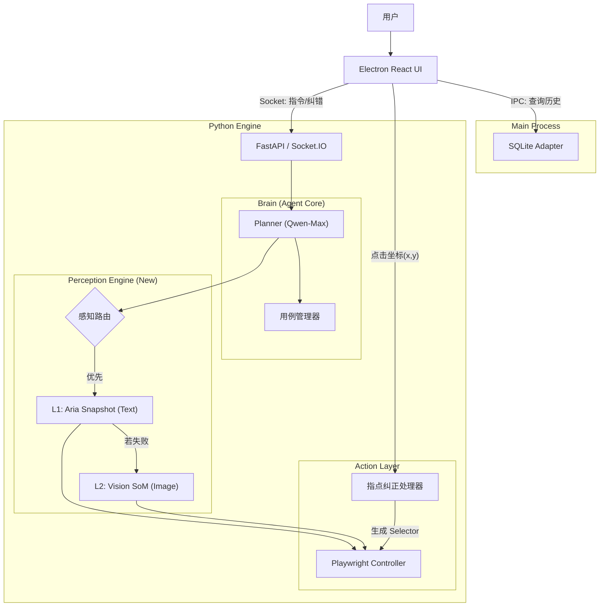

这是一份针对 **DianDian v1.1** 的详细技术架构迭代文档。文档重点描述了从 v1.0 单一视觉模式向 **v1.1 混合感知模式** 的架构迁移，以及新增的 **数据持久化** 和 **人机交互** 机制。

---

# DianDian v1.1 技术架构迭代文档

**文档版本：** v1.1
**前置文档：** DianDian v1.0 架构文档
**核心变更：** 引入混合感知引擎 (Hybrid Perception)、SQLite 持久化层、人机协同纠错机制。

---

## 1. 架构变更总览 (Architecture Delta)

### 1.1 核心差异对比

| 模块       | v1.0 (MVP)                          | v1.1 (Iteration)                            | 技术动因                                       |
| :--------- | :---------------------------------- | :------------------------------------------ | :--------------------------------------------- |
| **感知层** | 纯视觉 (Screenshot + SoM + Qwen-VL) | **混合感知 (Text-First + Vision-Fallback)** | 降低 Token 成本 (↓70%)，提升响应速度 (↑300%)。 |
| **数据层** | 内存暂存 (无持久化)                 | **SQLite 本地数据库**                       | 支持用例保存、回放及历史记录管理。             |
| **交互层** | 单向控制 (AI -> Browser)            | **双向协同 (Human <-> AI)**                 | 解决 AI 无法定位时的卡死问题，引入“指点纠正”。 |
| **环境层** | 仅桌面 (Desktop)                    | **多端模拟 (Mobile/Desktop)**               | 满足 H5/移动端网页测试需求。                   |

### 1.2 迭代后的逻辑架构图



---

## 2. 核心模块详细设计

### 2.1 混合感知引擎 (Hybrid Perception Engine)

这是 v1.1 的技术核心。我们不再无脑截图，而是构建一个**状态机**。

#### 2.1.1 工作流逻辑
1.  **State: Fast-Path (L1)**
    *   **输入:** `page.locator("body").aria_snapshot()` (YAML 文本)。
    *   **模型:** `qwen-max` (纯文本)。
    *   **Prompt:** "当前页面结构如下[YAML]... 目标是[Goal]。请返回 Playwright Locator。"
    *   **转换条件:**
        *   成功 -> 执行 Action。
        *   失败 (模型返回 `NEED_VISION` 或 Locator 执行超时) -> 进入 State L2。

2.  **State: Slow-Path (L2)**
    *   **输入:** `page.screenshot()` + JS 注入 SoM 标记。
    *   **模型:** `qwen-vl-max` (视觉)。
    *   **Prompt:** "文本结构无法定位。请查看截图，告诉我目标元素的数字 ID。"
    *   **转换条件:**
        *   成功 -> 执行 Action，重置回 State L1 (假设下一个页面比较简单)。
        *   失败 -> 抛出 `Require_Human_Intervention` 事件。

#### 2.1.2 Python 实现伪代码
```python
async def smart_locate_and_act(page, goal):
    # --- Phase 1: Text First ---
    try:
        snapshot = await page.locator("body").aria_snapshot()
        # 调用 Qwen-Max
        decision = await ask_qwen_text(snapshot, goal) 
        
        if decision['action'] == 'need_vision':
            raise VisionRequiredException()
            
        # 尝试执行文本决策
        await page.locator(decision['locator']).click(timeout=2000)
        return "Success via L1"
        
    except (VisionRequiredException, PlaywrightTimeoutError):
        # --- Phase 2: Vision Fallback ---
        print("L1 failed, switching to Vision...")
        screenshot = await add_som_and_screenshot(page)
        # 调用 Qwen-VL
        decision = await ask_qwen_vl(screenshot, goal)
        
        await click_by_som_id(page, decision['id'])
        return "Success via L2"
```

### 2.2 数据持久化层 (SQLite Integration)

为了方便管理，我们将 SQLite 集成在 Python 侧（而非 Electron 侧），利用 **SQLModel (SQLAlchemy)** 进行 ORM 管理。

#### 2.2.1 数据库 Schema (Python Models)

```python
from sqlmodel import SQLModel, Field, JSON
from typing import List, Optional
from datetime import datetime

class TestCase(SQLModel, table=True):
    id: Optional[int] = Field(default=None, primary_key=True)
    name: str
    description: Optional[str] = None
    # 存储核心步骤，例如: ["打开百度", "输入'Python'", "点击搜索"]
    prompts: List[str] = Field(default=[], sa_type=JSON) 
    # 环境配置: {"mobile": True, "viewport": {...}}
    config: dict = Field(default={}, sa_type=JSON)
    created_at: datetime = Field(default_factory=datetime.utcnow)

class TestRun(SQLModel, table=True):
    id: Optional[int] = Field(default=None, primary_key=True)
    case_id: Optional[int] = Field(default=None, foreign_key="testcase.id")
    status: str # "PASS", "FAIL"
    logs: str # 简单的文本日志
    created_at: datetime = Field(default_factory=datetime.utcnow)
```

#### 2.2.2 用例回放机制 (Replay)
*   **原理:** 不存储底层的 Selector（因为页面会变），而是存储 **User Prompts (意图)**。
*   **流程:**
    1.  前端触发 `replay_case(case_id)`。
    2.  后端读取 `TestCase.prompts`。
    3.  初始化一个新的 Browser Context。
    4.  遍历 `prompts` 列表，依次调用 Agent。
    5.  *优化:* 回放时，可以将上一次成功的 Selector 作为 "Hint" 传给 Agent，提高 L1 命中率。

### 2.3 指点纠正 (Point & Teach)

解决 "AI 卡死" 的终极方案。

#### 2.3.1 技术链路
1.  **UI 层 (React):**
    *   用户在右侧直播流图片上点击。
    *   ` sendCoords(e.nativeEvent.offsetX, e.nativeEvent.offsetY)} />`
    *   获取相对于图片左上角的 `(x, y)` 坐标，并通过 Socket 发送给 Python。

2.  **后端层 (Python):**
    *   接收事件 `human_click_correction` `{x: 100, y: 200}`。
    *   **坐标转换:** 根据截图缩放比例，还原到真实网页坐标。
    *   **反查元素:**
        ```python
        element_handle = await page.evaluate_handle(
            "([x, y]) => document.elementFromPoint(x, y)", 
            [real_x, real_y]
        )
        ```
    *   **生成 Selector:** 调用 Playwright 内部逻辑或简易 JS 生成该元素的唯一 Selector (CSS/XPath)。
    *   **执行与记忆:** 点击该元素，并将生成的 Selector 存入当前会话的上下文，告诉 AI "刚才用户点了这个，你记一下"。

### 2.4 移动端模拟 (Mobile Emulation)

在 Playwright 启动时注入参数。

```python
# engine/browser/driver.py

async def launch_browser(config: dict):
    browser = await playwright.chromium.launch(headless=False)
    
    if config.get('mobile_mode'):
        # 模拟 iPhone 13
        device = playwright.devices['iPhone 13']
        context = await browser.new_context(**device)
    else:
        # 桌面模式
        context = await browser.new_context(
            viewport={'width': 1280, 'height': 800}
        )
    return context
```

---

## 3. 接口协议升级 (Socket.IO API)

针对 v1.1 更新通信协议：

| 事件 (Event)  | 方向   | 数据 (Payload)                        | 说明                                |
| :------------ | :----- | :------------------------------------ | :---------------------------------- |
| `save_case`   | UI->Py | `{ name: "...", prompts: [...] }`     | 保存当前会话为用例                  |
| `load_cases`  | UI->Py | `{}`                                  | 请求所有用例列表                    |
| `cases_list`  | Py->UI | `[ {id:1, name:"..."}, ... ]`         | 返回用例列表                        |
| `replay_case` | UI->Py | `{ case_id: 1 }`                      | 开始回放                            |
| `correction`  | UI->Py | `{ x: 200, y: 300 }`                  | 人工指点坐标                        |
| `ai_state`    | Py->UI | `{ state: "L1_TEXT" \| "L2_VISION" }` | 告知前端当前使用的模式(用于显示⚡/👁️) |

---

## 4. 开发与迁移计划

### 4.1 环境准备
*   引入 `sqlmodel` 库。
*   升级 `playwright` 到最新版以确保 `aria_snapshot` 稳定支持。

### 4.2 开发步骤
1.  **Step 1: 数据库层开发**
    *   建立 SQLite 连接，编写 CRUD 接口。
2.  **Step 2: 混合引擎改造**
    *   拆分原有的 Executor，封装 `AriaSnapshotService` 和 `VisionService`。
    *   编写路由逻辑。
3.  **Step 3: 前后端交互升级**
    *   前端实现“指点”点击事件监听。
    *   后端实现 `elementFromPoint` 逻辑。
4.  **Step 4: 用例库 UI**
    *   实现保存、列表、回放 UI。

---

## 5. 潜在风险与应对

1.  **Aria Snapshot 信息量不足:**
    *   *风险:* 某些主要用 Canvas 绘制的网页（如 Figma, 游戏）Aria Tree 是空的。
    *   *应对:* 状态机逻辑必须健壮。如果 Aria Tree 为空或极短，直接跳过 L1 进入 L2。

2.  **坐标偏移问题:**
    *   *风险:* 前端显示的图片经过缩放（CSS `object-fit: contain`），导致用户点击坐标与 Playwright 实际坐标不一致。
    *   *应对:* 前端必须发送图片的 `naturalWidth/Height` 和显示的 `clientWidth/Height`，由后端进行精确的比例换算。

3.  **数据库版本管理:**
    *   *风险:* 后续升级字段变更。
    *   *应对:* v1.1 暂不引入 Alembic 迁移工具，若数据库结构变更，简单处理为“重建数据库文件” (MVP 策略)。
